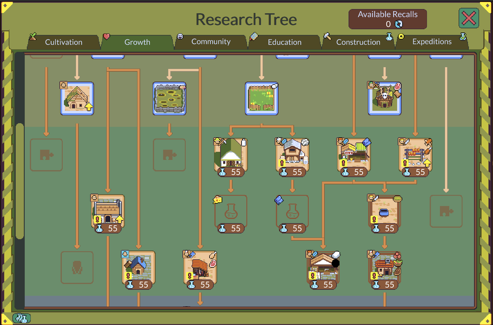
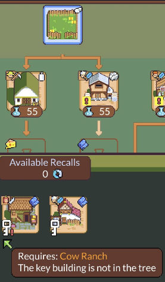

# dotAGE

- **Genre:** Turn-based roguelite village builder. You are the Elder guiding a village of pips
  through worker-placement turns, teching up a within-run research tree while an escalating
  Prophecy hurls worse events at you each turn. It is solo-built by Michele Pirovano, which
  makes it the closest genre-and-scope match in the map.
- **Why a candidate:** It is the master map's closest holistic analog (86), a solo-built
  turn-based management *roguelite*, so it shows up across Approaches 2, 3, 4, and 6 rather
  than in one. Its peak is Approach 4, because the memory-points system is a roguelite research
  tree inside a management game, near-exactly what the un-built LobCorp research tree (the map's
  "glue") proposes.
- **Confidence:** medium — the game-level read is high-confidence from the master map and
  corroborated by public write-ups, but the load-bearing POC detail (whether across-run memory
  is option-expansion or net power creep, and how it splits against the within-run tech tree)
  is not yet observed firsthand.
- **Readiness:** researching

## Mechanic inventory *(relaxed)*

Seeded from the master map's read plus public write-ups, to verify and deepen by play:
- **Worker-placement pips (within-run engine).** Each turn you assign pips to daily tasks
  (farm, herd, forge, research, bury), and unfed pips sicken, so the moment-to-moment
  management is a board-game-style worker-placement economy.
- **Within-run research/tech tree.** Every building is gated behind a research tree, and a pip
  assigned to a research building generates research points per day. This is the *within-run*
  progression axis.
- **Across-run memory points (meta-progression, the peak lever).** Every run (win or lose)
  converts producing, building, and event outcomes into memory points, spent as currency to
  unlock content that appears in *future* runs — new buildings, specialized roles, ailments,
  VIPs, and new Elders. Public write-ups stress most memory unlocks add features to your *next*
  run, not power to the current one ("unlock fish and it won't add fish to your current map"),
  so it reads as option-space expansion. But reviewers also say the game "only gets easier"
  over time, so whether it is net power creep is the open firsthand question.
- **Research-tree preview and candidate pools (progression legibility).** The tree renders
  three knowledge tiers: memory-locked content appears as greyed empty slots, so the run
  itself advertises what meta-progression could add; a known node telegraphs its output
  resource while hiding which of its candidates this run rolled (cheese after milk: Dairy at
  3 milk → 2 cheese against Herbal Dairy at 1 milk + 2 hemp → 1 cheese); and an exclamation
  mark flags a building that needs a tech from an unresearched branch (Advanced Tools on the
  meat building). A candidate pool also renders a memory-locked third slot, so memory unlocks
  widen the roll pool at existing nodes. A key-chain filter guarantees workability by
  construction: a candidate whose key building isn't in this run's tree cannot roll (a Sheep
  Pen run excludes the cow-leather fabric maker), and the UI shows the exclusion with the
  reason.
- **Elders (asymmetric starts).** Each Elder changes a run's rules, not just a bonus, and new
  Elders are themselves memory unlocks, so Approaches 3 and 4 are entangled here.
- **Prophecy events across four Domains (escalating director).** The Prophecy is the run's
  spine: each turn the Domains unleash increasingly powerful events (poison, disease,
  earthquakes) that you must out-produce protection against across four domains, a difficulty
  curve authored by a system and scaling off run progress.
- **Difficulty / mastery / challenge modes.** Multiple difficulty tiers plus mastery levels,
  and beating the game on hard-or-harder unlocks a custom challenge mode. This is the tuning
  layer over the Prophecy curve.

Screenshots (2026-07-19 session, evidencing the preview bullet above):

*The Growth tab: greyed puzzle-piece slots advertise memory-locked content, and exclamation
marks flag buildings that need a tech from an unresearched branch.*

*The cheese node's candidate pool: Dairy, Herbal Dairy, and a memory-locked third slot.*

*The key-chain filter shown at the fabric node: the cow-leather candidate cannot roll because
this run rolled the Sheep Pen, and the UI says why.*

## Approach mapping *(graduating)*

- **1 drafted loadout + interacting pieces —** not this game's lever. dotAGE's within-run
  growth is a research *tree* you climb, not a draft-of-N offer you recombine, so the
  drafted-loadout lesson belongs to Slay the Spire and Against the Storm.
- **2 procedural / affixed content —** secondary (85). The building pool and research tree
  reshuffle run to run, which is the closest in-genre model for keeping a management economy
  fair while the available pieces shift, the exact tension affixed abnormalities create.
  Firsthand (2026-07-19): it holds that fairness through category-telegraphed rolls (a node
  shows its output resource and hides the rolled candidate), contextual candidate value, and a
  by-construction key-chain filter that keeps every rollable candidate workable, with
  exclusions shown.
- **3 asymmetric starts / factions —** secondary (85). Each Elder reshapes a whole run's rules
  rather than granting a bonus, which is the bar a patron-Sephirah should clear and the
  load-bearing in-genre proof for that lever.
- **4 meta-progression / unlock divergence —** peak (86). The memory-points system is a
  roguelite research tree in a management game, near-exactly what the LobCorp research tree
  proposes, and how it splits power between within-run tech and across-run memory is the
  hardest balance question the map poses for this game.
- **5 structural run-restructuring —** partial. A run's *shape* (settle, tech up, out-produce
  the Prophecy) is fixed, so the imposed Elder, starting event, and reshuffled pool vary
  contents and conditions rather than the run's structure.
- **6 emergent systems + adaptive director + procedural history —** secondary (85). The
  Prophecy is a clean threat-pacing curve scaling late-run events off run progress, the
  in-genre proof that a managed escalation curve works, though it ramps off a fixed schedule
  rather than reading live game state the way a true director would.

## Answered questions *(relaxed)*

(none yet)

## Open questions *(relaxed)*

- **Is across-run memory option-space expansion or net power creep, and how does it split
  against the within-run tech tree?** This is the load-bearing POC question for dotAGE's peak
  lever, because it decides whether the LobCorp research tree should widen *what can appear*
  across runs (the retention-without-power-creep model the map wants) or risk front-loading
  power that flattens later runs (the Rogue Legacy failure mode). The first in-game task chases
  exactly this. *(2026-07-19 debrief: candidate pools render memory-locked slots beside the
  unlocked candidates, a firsthand lean toward option-expansion; the per-unlock classification
  task still stands.)*
- **debrief thread parked: does seeing the memory-locked slots in-run drive the urge to
  replay?** The greyed slots advertise the un-unlocked space; whether that visibility is what
  converts pool-widening into retention (a candidate visibility clause on the
  widen-what-can-appear lesson) wants more play observation or a resumed debrief.

## In-game task tracker *(relaxed)*

| Task | Status | Findings |
|---|---|---|
| Play 2–3 runs (win or lose — losing still banks memory points). Before starting, note what the memory/study screen already has unlocked. After each run, at the memory-unlock screen record: (a) which unlocks are *new options* (a new building, role, ailment, VIP, or Elder that widens what *can* appear next run) versus *raw power* (a bigger starting stockpile, a flat production or defense buff, a cheaper cost); and (b) for one unlock of each kind, whether it made the *next* run easier by giving you more to work with or by making the same line stronger. Separately, in one run note one case where the *within-run* research tree — not memory — was what carried that run, to mark the boundary between the two axes. Write down, one line each: "memory unlocks skew option-expansion / raw-power / both," and "within-run tech owns X, memory owns Y." | assigned | |

## Integration hypotheses & what won't transfer *(graduating)*

- **Provisional (pending the memory power-split task).** If dotAGE's memory system earns its
  retention by widening *what can appear* next run rather than by starting you stronger, then
  the LobCorp research tree should unlock abnormalities, E.G.O., and mechanics into the run's
  *option pool* across runs, so a failed run funds a broader next run rather than a more
  powerful one, which keeps late runs varied instead of merely easier. What won't transfer is
  dotAGE's clean two-axis split, because dotAGE separates a within-run research tree from
  across-run memory and LobCorp's existing research tree is already the within-run unlock
  spine, so the mod has to decide whether the roguelite meta-layer sits above that tree or
  replaces it, a fork dotAGE does not have to resolve.
- **Firsthand (2026-07-19 debrief).** dotAGE's tree previews are the first in-genre proof of
  the blind-pick's information design, because they telegraph a roll's category while hiding
  the piece, and the hedging that gap forces is the variance paying out as decisions. That
  sets the disclosure dial at both ends for the mod: a rolled abnormality or research unlock
  shows its category and risk tier, hides its identity, and rolls from a pool filtered by
  construction so nothing the current run can't support can appear, with the exclusion shown
  the way dotAGE red-flags an unreachable key building.

## Session log *(relaxed)*

- 2026-07-05 scaffolded from the master map's Approach 2/3/4/6 read, corroborated against
  public write-ups; queued the Approach-4 memory power-split task as the first firsthand
  unknown, per the first-lever choice.
- 2026-07-19 debriefed the research-tree preview system: landed "Telegraph the category, hide
  the piece" into the lessons doc, added firsthand dotAGE evidence to four existing lessons
  (promoting randomize-the-pairings to established), and parked the retention-visibility
  thread; the memory power-split task stays assigned.
